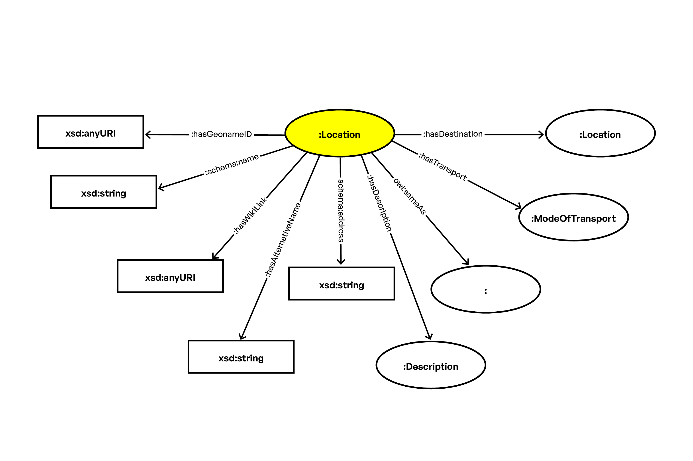
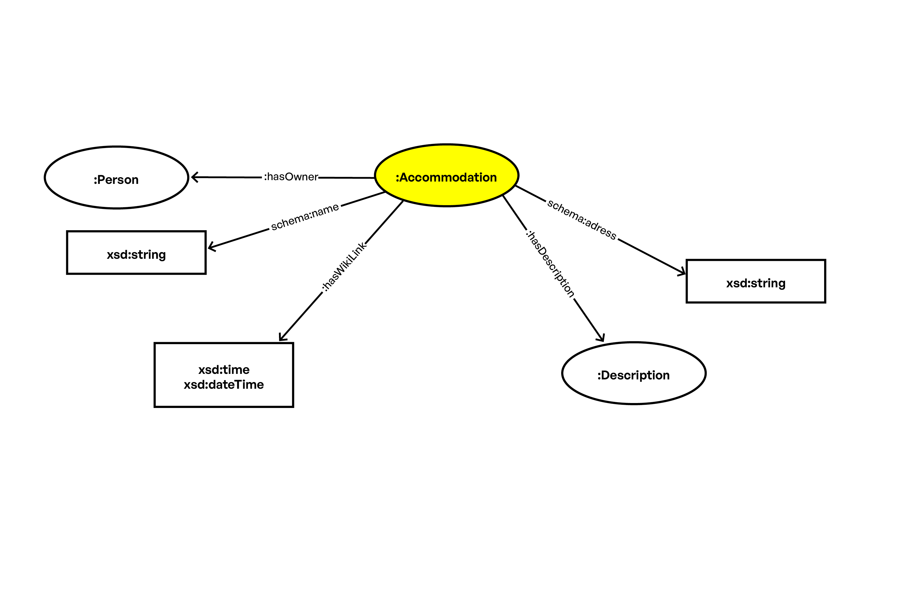
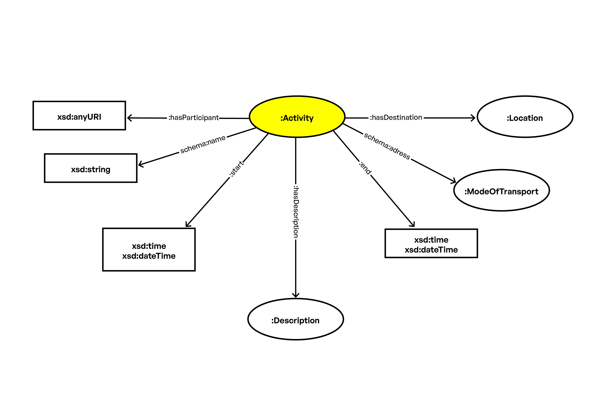
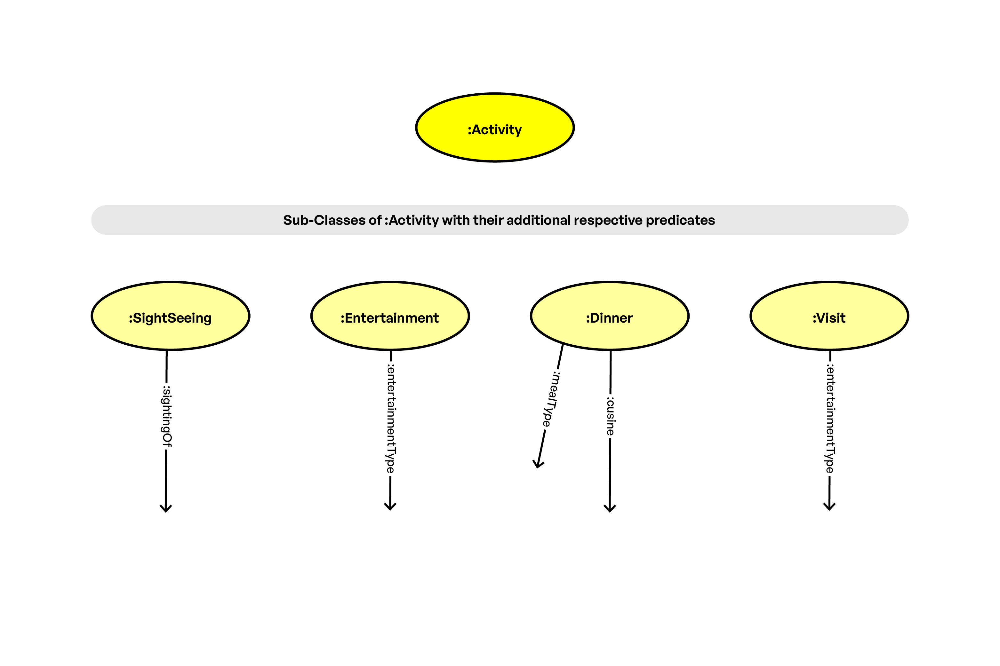
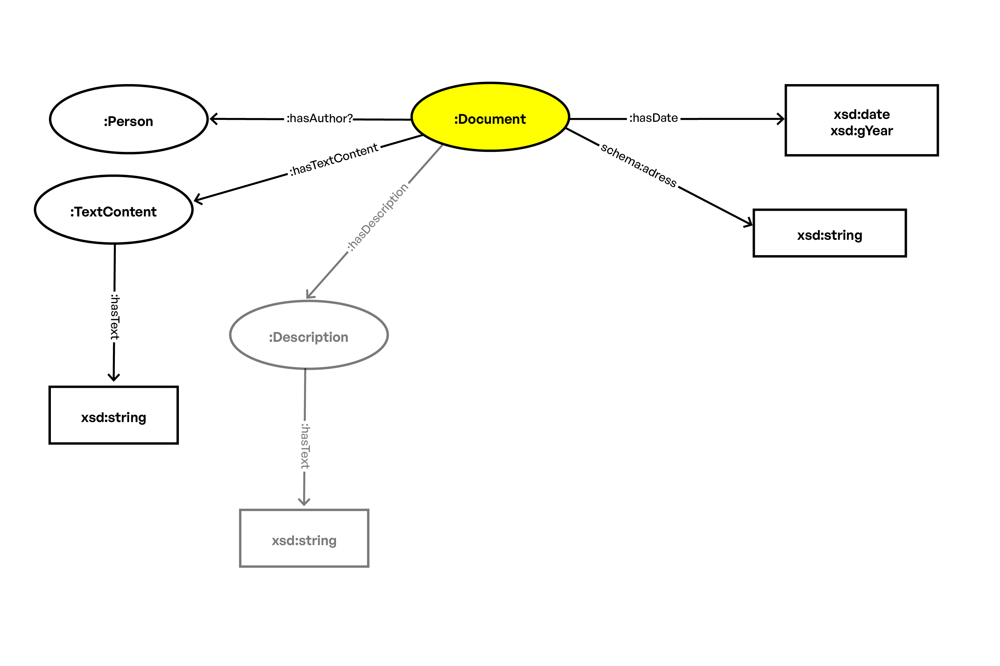

<!-- static png -->
<!--  -->

<!-- animated gif -->


<!-- ## Trip-ontology BOT -->


# Trip Ontology | RDF-Star application

### The trip ontology we are about to present, offers multiple ways of applying different complexities of metadata by making use of state of the art [Rdf-star](https://www.w3.org/2022/08/rdf-star-wg-charter/) technology. Disclaimer: data used to illustrate the application of the trip ontology is inspired but only loosely accurate to an actual journey…dates and personas have been created with the help of chatGPT.

# INTRODUCING THE VOCABULARY
# Classes

## **PERSON**
a trip:Person is a rdfs:subClassOf schema:Person 


Ex: schema:gender as can be seen in [shacl shapes file](../tripOntology_shacl.ttl)


<!-- | Class | characteristics | trip-Predicates|
|----------|----------|----------|
| trip:Person      | schema:name             | trip:hasJourney   |
| rdfs:subClassOf schema:person   | schema:givenName        | trip:participatedIn   |
|                                 | schema:gender           | add: trip:hasDisability   |
|                                 | schema:birthDate        |     |
|                                 | schema:birthPlace       |     | -->


## Location
trip:Location rdfs:subClassOf dbr:Location



## Trip [change back to travel for travelStage]
Trip serves as parent class of trip:Journey and trip:Excursion. It represents the movement from one trip:Location to an other.

### Journey and Excursion
**trip:Journey owl:differentFrom trip:Excursion**. trip:Excursion is defined by returning to the location of departure without having a stay. A journey including a stay or happening during another or main-journey would make use of trip:hasSubJourney instead of trip:hasJourney.


### Excursion

## Stay
A stay is defined by staying in a trip:Location for at least one night up onto a undefined amount of time. A stay >> :hasAccommodation >> :hasActivity?

## Accommodation 
An accommodation can mean anything [Unterkunft bis Unterschlupf]@de from tent to hotel.


## Activity
:hasActivity :Activity can either be placed on the edge of a graph or directly attached to a :Journey or :Stay .


<!-- * :Sight-Seeing 
* :Entertainment
* :Visit 
* :Dining -->

## Mode of Transport
the trip:ModeOfTransport is a rdfs:subClass of schema:ModeOfTransport
domain: hasTransport  
* Ferry
* Train
* Ship 
* 

## Manuscript
### Travel Diary

## Document


## Text Content
### Description

* to has text?
* draw the workflow around the document shape 

# PropertyShapes

<!--  -->

# Different levels of rdf* application

## Low rdf star application
The in the lowest amount via rdf* added metadata is 

</br>
</br>

## Medium rdf star application

</br>
</br>

````
:SofiaM :hasJourney :Journey_2018_03 .
<< :SofiaM :hasJourney :Journey_2018_03 >> :hasStartDate "2018-03-10"^^xsd:date .
<< :SofiaM :hasJourney :Journey_2018_03 >> :hasEndDate "2018-03-22"^^xsd:date.

:Journey_2018_03 a :Journey ;
    :hasStartLocation :Zurich;
    :hasDestination :Marrakech .

<< :Journey_2018_03 :hasStartLocation :Zurich >> :hasDeparture "2018-03-10T08:00:00"^^xsd:dateTime .
<< :Journey_2018_03 :hasStartLocation :Marrakech >> :hasArrival "2018-03-10T22:00:00"^^xsd:dateTime .

````


## High amount of rdf star application


</br>
</br>

# Shacl-Shape Data Validation


<style>
.elements {
  margin-top: 50px; /* Adds 20 pixels of margin at the bottom of all elements with class 'elements' */
}
</style>

<!-- <div class=elements style="width: 100%; height: 25vw; overflow: auto; position: relative;"> -->

  <!-- Content that exceeds the dimensions of the div will be scrollable -->
 
 <!-- 
   -->
<!-- 
<div class="elements" style="width: 100%; height: 50vw; overflow: auto; position: relative;">
  <!-- Content that exceeds the dimensions of the div will be scrollable -->
  <!-- 
  
</div> --> -->


<!-- </div> -->

<!-- This is a comment in Markdown. It won't be visible in the rendered output. -->

<!-- # ENLARGENING

<style>
.scrollable-div {
  width: 300px;
  height: 200px;
  overflow: auto; /* Enable scrollbars if content overflows the specified dimensions */
}

.enlargening-lens {
  overflow: hidden;
  width: 100%; /* Set width to 100% to fill the scrollable div */
  height: 100%; /* Set height to 100% to fill the scrollable div */
}

.enlargening-lens img {
  object-fit: cover;
  transition: transform 0.3s ease;
}

.enlargening-lens:hover img {
  transform: scale(1.5);
}


</style>
<div class="enlargening-lens">

</div> -->


# SPARQL*

```

prefix onto:<http://www.ontotext.com/>

select ?subject ?predicate ?object

{
    ?subject a <http://www.mysemantics.com/ontology/trip/SightSeeing> . 
    ?subject ?predicate ?object.
}

```


```

### Trip ###
:Trip rdf:type owl:Class ;
        rdfs:label "Reisen"@de ,
                "Trip"@en ;
        rdfs:comment "Any type of movement between two locations."@en .

```
